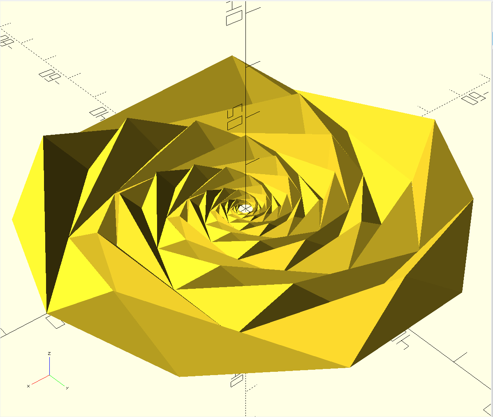

(English Text Below)

Bonjour !

Donc sur un groupe facebook, quelqu'un a posé une question: comment puis-je fabriquer l'image ci-dessous ?

Vous trouverez le fichier source openscad dans ce dépôt de code, en espérant qu'il vous sera utile.

Il est mis à votre disposition selon la license créative commons, merci de la respecter.

=========================================

Hello !

So, someone asked on a facebook group: how can how make something like this ?

You will find the openscad source code into this repository, hoping it's going to be useful.

It's provided to you under a creative commons license, please respect it.

